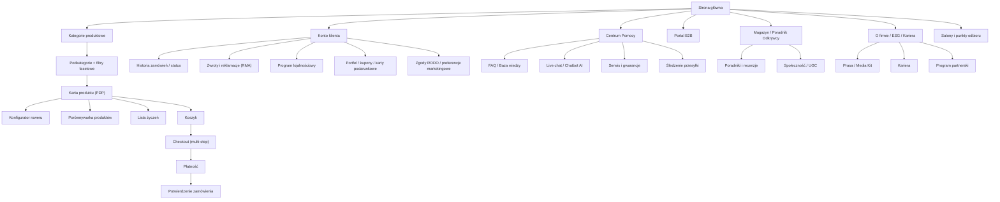

# 01 — Mapa strony i architektura informacji (Site Map & IA)

[← Wróć do indeksu](../README.md)

Poniższa struktura odwzorowuje kompletny serwis klasy enterprise — nie tylko sklep, ale ekosystem treści, narzędzi i kanałów obsługi, jakie budują największe marki (Decathlon, REI, Zalando). Każda podstrona ma zdefiniowany cel biznesowy, priorytet wdrożenia (MVP / Faza 2 / Faza 3) i właściciela funkcjonalnego.

## 1.1 Diagram architektury informacji

## 1.2 Pełna lista podstron

### Warstwa transakcyjna (Core Commerce)

| Podstrona | URL wzorcowy | Cel biznesowy | Priorytet |
|---|---|---|---|
| Strona główna | `/` | Konwersja, prezentacja hero/promocji, personalizacja segmentowa | MVP |
| Listing kategorii | `/rowery-elektryczne/`, `/namioty-dachowe/`, `/stacje-zasilania/` | Nawigacja, filtrowanie fasetowe, SEO (landing pages kategorii) | MVP |
| Karta produktu (PDP) | `/produkt/{slug}` | Konwersja, dane strukturalne SEO, warianty, cross-sell | MVP |
| Konfigurator roweru | `/konfigurator/{model}` | Personalizacja zestawu (rama+bateria+akcesoria), zwiększenie AOV | Faza 2 |
| Porównywarka produktów | `/porownaj?ids=...` | Wsparcie decyzji zakupowej, redukcja odejść | Faza 2 |
| Lista życzeń (Wishlist) | `/konto/lista-zyczen` | Retencja, remarketing (powiadomienia o cenie/dostępności) | MVP |
| Koszyk | `/koszyk` | Podsumowanie, upsell, kody rabatowe, kalkulacja dostawy | MVP |
| Checkout (multi-step) | `/checkout/dostawa`, `/checkout/platnosc`, `/checkout/podsumowanie` | Minimalizacja tarcia, checkout gościa, autouzupełnianie adresu (GUS/API pocztowe) | MVP |
| Potwierdzenie zamówienia | `/checkout/potwierdzenie/{order_id}` | Cross-sell po zakupie, zaproszenie do programu lojalnościowego | MVP |
| Karty podarunkowe | `/karty-podarunkowe` | Dodatkowy kanał przychodu, prezent dla nowego segmentu klientów | Faza 2 |
| Wyszukiwanie / wyniki | `/szukaj?q=...` | Wyszukiwanie semantyczne z autouzupełnianiem i korektą literówek | MVP |

### Warstwa relacji z klientem (Customer Lifecycle)

| Podstrona | URL wzorcowy | Cel biznesowy | Priorytet |
|---|---|---|---|
| Panel klienta — dashboard | `/konto` | Centralny punkt zarządzania kontem | MVP |
| Historia i status zamówień | `/konto/zamowienia` | Transparentność, redukcja zgłoszeń „gdzie moja przesyłka” | MVP |
| Śledzenie przesyłki | `/sledz-przesylke/{tracking_no}` | Samoobsługowe śledzenie, integracja z API kurierów | MVP |
| Zwroty i reklamacje (RMA) | `/konto/zwroty/nowy` | Samoobsługowy proces zwrotu z generowaniem etykiety | MVP |
| Serwis i gwarancje | `/serwis` | Zgłoszenia serwisowe rowerów (naprawy, przeglądy okresowe) | Faza 2 |
| Program lojalnościowy | `/program-lojalnosciowy` | Retencja, LTV, punkty za zakupy/recenzje/polecenia | Faza 2 |
| Program partnerski/afiliacyjny | `/partnerzy` | Nowy kanał akwizycji (influencerzy, blogerzy outdoor) | Faza 3 |
| Portfel i kupony | `/konto/portfel` | Zarządzanie środkami zwrotnymi, kodami rabatowymi | MVP |
| Ustawienia i zgody RODO | `/konto/prywatnosc` | Zarządzanie zgodami marketingowymi, eksport/usunięcie danych | MVP |
| Newsletter — zapis/wypis | `/newsletter` | Budowa bazy e-mail, double opt-in | MVP |

### Warstwa treści i marki (Content & Brand)

| Podstrona | URL wzorcowy | Cel biznesowy | Priorytet |
|---|---|---|---|
| Magazyn „Poradnik Odkrywcy” | `/magazyn` | SEO (long-tail), edukacja produktowa, autorytet marki | MVP |
| Artykuł/poradnik | `/magazyn/{slug}` | Ruch organiczny, wewnętrzne linkowanie do PDP | MVP |
| Recenzje i UGC (galeria klientów) | `/magazyn/spolecznosc` | Social proof, treści generowane przez użytkowników | Faza 2 |
| O nas | `/o-nas` | Storytelling marki, zaufanie | MVP |
| ESG / Zrównoważony rozwój | `/zrownowazony-rozwoj` | Raport śladu węglowego, recyklingu baterii, coraz częściej wymagane przez klientów B2B/inwestorów | Faza 2 |
| Kariera | `/kariera` | Employer branding, oferty pracy (integracja z ATS) | Faza 2 |
| Prasa / Media Kit | `/prasa` | Materiały dla dziennikarzy, logotypy, kontakt PR | Faza 3 |
| Salony i punkty odbioru | `/salony` | Store locator (mapa, godziny, zapasy lokalne) | MVP |

### Warstwa B2B i wsparcia (Enterprise & Support)

| Podstrona | URL wzorcowy | Cel biznesowy | Priorytet |
|---|---|---|---|
| Portal B2B — logowanie | `/b2b/logowanie` | Dedykowany katalog i cennik dla firm/flot rowerowych | Faza 3 |
| Zapytanie ofertowe (RFQ) | `/b2b/zapytanie-ofertowe` | Obsługa zamówień hurtowych, wycena indywidualna | Faza 3 |
| Kalkulator finansowania/rat | `/finansowanie` | Redukcja bariery cenowej dla e-bike (rata 0%) | Faza 2 |
| Centrum Pomocy / FAQ | `/pomoc` | Baza wiedzy z wyszukiwarką, redukcja obciążenia BOK | MVP |
| Live chat / Chatbot AI | widget globalny | Wsparcie 24/7, kwalifikacja zgłoszeń przed przekazaniem do człowieka | Faza 2 |
| Kontakt | `/kontakt` | Formularz z reCAPTCHA/Turnstile, dane kontaktowe, mapa | MVP |
| Status systemu (status page) | `status.summitandtrail.pl` | Transparentność dostępności usług dla klientów B2B/enterprise | Faza 2 |

### Warstwa prawna i techniczna (Legal & Technical)

| Podstrona | URL wzorcowy | Cel biznesowy | Priorytet |
|---|---|---|---|
| Regulamin | `/regulamin` | Zgodność prawna | MVP |
| Polityka prywatności | `/polityka-prywatnosci` | RODO | MVP |
| Polityka cookies | `/polityka-cookies` | RODO/ePrivacy, panel CMP | MVP |
| Deklaracja dostępności | `/deklaracja-dostepnosci` | Zgodność z Europejskim Aktem o Dostępności (EAA 2025) | MVP |
| Mapa strony (HTML) | `/mapa-strony` | UX i SEO wsparcie indeksacji | MVP |
| Mapa strony (XML) | `/sitemap.xml` (+ `sitemap-products.xml`, `sitemap-blog.xml`) | Techniczne SEO, segmentacja sitemap dla dużego katalogu | MVP |
| Strona 404 | `*` | Utrzymanie użytkownika (wyszukiwarka, popularne kategorie) | MVP |

## 1.3 Zasady projektowania nawigacji

- **Nawigacja główna (mega menu):** maksymalnie 3 poziomy głębokości, kategorie prezentowane z miniaturami i linkami do bestsellerów/promocji.
- **Breadcrumbs** na każdej podstronie produktowej i kategorii — wspierają SEO (dane strukturalne `BreadcrumbList`) i UX.
- **Sticky search bar** z podpowiedziami produktowymi (autosuggest z obrazkiem, ceną i dostępnością) w czasie rzeczywistym.
- **Responsive-first:** IA projektowana mobile-first — mega menu desktopowe redukowane do akordeonu na mobile, dolna belka nawigacyjna (bottom nav) z dostępem do: Szukaj, Konto, Koszyk, Wishlist.
- **Personalizacja struktury:** zalogowani klienci B2C vs B2B widzą różne warianty menu głównego (np. klienci B2B widzą link do Portalu B2B i cenniki netto).
