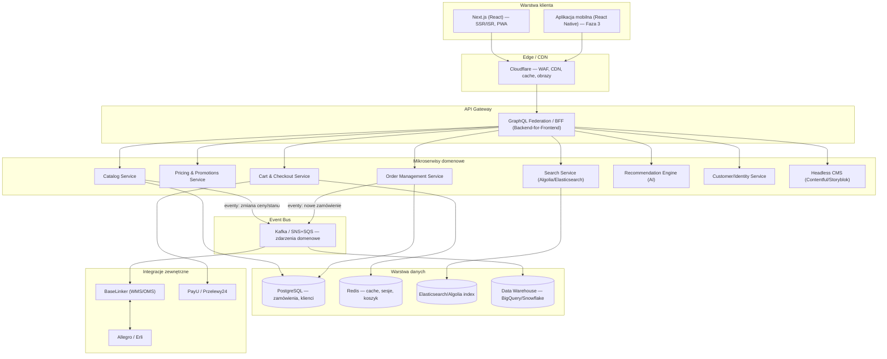

# 03 — Architektura techniczna i stack (Composable Commerce)

[← Wróć do indeksu](../README.md)

Summit & Trail wykorzystuje model **composable commerce (MACH: Microservices, API-first, Cloud-native, Headless)** — architekturę stosowaną przez liderów e-commerce (Decathlon, Zalando), zamiast monolitycznej platformy typu all-in-one. Zaletą jest niezależne skalowanie, wymienność komponentów bez przepisywania całości oraz odporność na wzrost ruchu (np. Black Friday).

## 3.1 Diagram architektury systemu



## 3.2 Stack technologiczny

| Warstwa | Technologia | Uzasadnienie |
|---|---|---|
| Frontend | Next.js 15 (React, App Router), TypeScript | SSR/ISR dla SEO, streaming, RSC dla wydajności |
| Stylowanie / design system | Tailwind CSS + biblioteka komponentów (Storybook) | Konsystencja UI, szybkie iteracje |
| State management | React Query / TanStack Query + Zustand | Cache danych serwerowych, minimalny boilerplate |
| Backend commerce engine | Mikroserwisy Node.js/NestJS lub Go (per domena) | Niezależne skalowanie, izolacja błędów |
| API | GraphQL Federation (Apollo/Cosmo) + REST dla integracji zewnętrznych | Jeden kontrakt dla frontendu, elastyczność zapytań |
| Baza danych transakcyjna | PostgreSQL (multi-AZ, read replicas) | ACID dla zamówień i płatności |
| Cache / sesje / koszyk | Redis Cluster | Niskie opóźnienia, TTL dla koszyków gości |
| Wyszukiwanie | Algolia (lub Elasticsearch self-hosted) | Faceted search, typo-tolerance, personalizacja wyników |
| CMS treści (blog, landing, banery) | Headless CMS (Contentful / Storyblok) | Marketing edytuje treści bez deploy'u kodu |
| Kolejkowanie / event bus | Apache Kafka (lub AWS SNS+SQS) | Asynchroniczna komunikacja mikroserwisów, odtwarzalność zdarzeń |
| Konteneryzacja / orkiestracja | Docker + Kubernetes (EKS/GKE) | Auto-scaling, self-healing, wdrożenia bez przerw |
| CDN / Edge | Cloudflare (Enterprise) | WAF, cache, obrazy (Polish/Image Resizing), Workers dla logiki edge |
| Infrastructure as Code | Terraform + Helm charts | Odtwarzalność środowisk, wersjonowana infrastruktura |

## 3.3 Środowiska i strategia wdrożeń (CI/CD)

| Środowisko | Cel | Dane | Dostęp |
|---|---|---|---|
| `dev` | Praca deweloperska, feature branches | Dane syntetyczne | Zespół deweloperski |
| `staging` | UAT, testy regresji, demo dla Klienta | Kopia anonimizowanych danych produkcyjnych | Zespół + Klient (VPN/basic auth) |
| `production` | Ruch użytkowników końcowych | Dane rzeczywiste | Publiczny |

### Pipeline CI/CD (GitHub Actions / GitLab CI)

```yaml
stages:
  - lint        # ESLint, Prettier, TypeScript check
  - test        # Jednostkowe (Vitest/Jest) + integracyjne (Testcontainers)
  - security    # SAST (Semgrep), dependency scan (Snyk/Dependabot)
  - build       # Build obrazów Docker, tagowanie SHA commitu
  - e2e         # Testy end-to-end (Playwright) na środowisku ephemeral (preview deploy)
  - deploy-staging
  - manual-approval   # Wymagana akceptacja przed produkcją
  - deploy-production # Strategia canary (5% → 25% → 100% ruchu) lub blue-green
  - smoke-test  # Health-check kluczowych ścieżek po wdrożeniu
```

- **Strategia wdrożeń produkcyjnych:** canary release lub blue-green — zero-downtime deployment, automatyczny rollback przy wzroście błędów (>1% 5xx w oknie 5 min).
- **Feature flags** (LaunchDarkly/Unleash) — wdrażanie kodu niezależnie od aktywacji funkcji biznesowej, testy A/B na poziomie infrastruktury (patrz dok. 09).

## 3.4 Observability i wydajność

| Obszar | Narzędzie | Cel/SLO |
|---|---|---|
| APM (Application Performance Monitoring) | Datadog / New Relic | p95 czasu odpowiedzi API < 300 ms |
| Logi scentralizowane | ELK Stack / Datadog Logs | Retencja 90 dni, alertowanie na wzorce błędów |
| Error tracking | Sentry | MTTR (mean time to resolution) < 4h dla błędów krytycznych |
| Uptime monitoring | Better Stack / Pingdom + status page publiczna | SLA 99.9% dostępności (dok. 11) |
| Real User Monitoring (RUM) | Cloudflare Analytics / Datadog RUM | Core Web Vitals w warunkach rzeczywistych |

### Budżet wydajności (Core Web Vitals)

| Metryka | Cel | Sposób realizacji |
|---|---|---|
| LCP (Largest Contentful Paint) | < 2,5 s | SSR/ISR, priorytetowe ładowanie hero image, preconnect do CDN |
| INP (Interaction to Next Paint) | < 200 ms | Code-splitting, minimalizacja JS na krytycznej ścieżce, React Server Components |
| CLS (Cumulative Layout Shift) | < 0,1 | Rezerwacja miejsca dla obrazów/reklam, `font-display: swap` |
| TTFB | < 600 ms | Edge caching (Cloudflare), read-replica bazy danych blisko regionu użytkownika |

## 3.5 Skalowalność i odporność (Disaster Recovery)

- **Auto-scaling:** Horizontal Pod Autoscaler w Kubernetes wg CPU/RPS — automatyczne skalowanie w okresach szczytowych (Black Friday, kampanie).
- **Multi-AZ / multi-region:** baza danych w konfiguracji multi-AZ z automatycznym failover; statyczne assety serwowane globalnie przez CDN.
- **Cele RTO/RPO:** RTO (Recovery Time Objective) ≤ 1h, RPO (Recovery Point Objective) ≤ 15 min — pełne backupy bazy co 6h + kontynualne WAL archiving.
- **Testy chaos engineering:** regularne testy odporności (np. symulacja utraty AZ) w środowisku staging przed sezonem szczytowym.
- **Load testing:** testy obciążeniowe (k6/Gatling) symulujące 10× standardowy ruch przed każdą dużą kampanią promocyjną.

Szczegóły planu disaster recovery, backupów i runbooków incydentowych — patrz [dokument 11](11-domena-dns-monitoring-dr.md).
