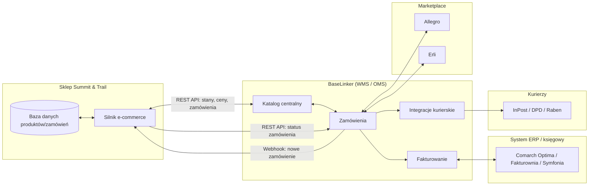

# 04 — Integracje: ERP, BaseLinker (WMS) i Marketplace

[← Wróć do indeksu](../README.md)

## 4.1 Architektura integracji

BaseLinker działa jako centralny hub WMS/OMS pomiędzy sklepem Summit & Trail, kurierami, systemem księgowym/ERP i marketplace'ami. Sklep nigdy nie komunikuje się bezpośrednio z Allegro/Erli — całą logikę multi-channel przejmuje BaseLinker.



## 4.2 Dwukierunkowa synchronizacja

| Przepływ | Kierunek | Mechanizm | Częstotliwość |
|---|---|---|---|
| Stany magazynowe | Sklep ⇄ BaseLinker | REST API (`productUpdateStock`/`productsGetList`) + webhook `order_status_changed` | Real-time (webhook) + sync co 5 min (fallback cron) |
| Ceny (w tym promocje) | Sklep ⇄ BaseLinker | REST API (`productUpdatePrices`) | Real-time przy zapisie w PIM |
| Zamówienia | BaseLinker → Sklep (status) / Sklep → BaseLinker (nowe zamówienie) | Webhook `newOrder` / `order_status_change` | Real-time |
| Dokumenty (faktury, etykiety) | BaseLinker → Sklep | REST API (`getOrderInvoice`, `getLabel`) | Real-time po wygenerowaniu |
| Dane księgowe | BaseLinker ⇄ ERP | Eksport okresowy (dzienny) do systemu księgowego (JPK, KPiR) | Batch (dzienny/miesięczny) |

**Zasada projektowa:** BaseLinker jest „source of truth” dla stanów magazynowych łączonych (wiele kanałów współdzieli magazyn); sklep własny jest „source of truth” dla treści produktowych (PIM — dok. 02); ERP jest „source of truth” dla danych finansowo-księgowych.

### Odporność integracji (reliability)

- **Idempotency keys** przy każdym wywołaniu tworzącym zasób (np. `order_external_id`) — zapobiega duplikacji zamówień przy retry.
- **Retry z exponential backoff** (do 5 prób) dla wywołań API zwracających 5xx/timeout; dead-letter queue dla zdarzeń trwale nieudanych, z alertem do zespołu operacyjnego.
- **Raporty rekoncyliacyjne** — nocny job porównujący stany magazynowe sklep vs BaseLinker vs marketplace, z alertem przy rozbieżności > 1 jednostki.
- **Rate limiting API BaseLinker:** limit 100 zapytań/min — kolejkowanie żądań przez wewnętrzny message broker, priorytetyzacja zdarzeń zamówień nad synchronizacją cen.

### Przykładowy webhook (BaseLinker → Sklep)

```json
{
  "event": "order_status_changed",
  "order_id": 2024113001,
  "order_source": "shop",
  "old_status_id": 91827,
  "new_status_id": 91830,
  "new_status_name": "Wysłane",
  "timestamp": 1785432000
}
```

### Przykładowe wywołanie API (Sklep → BaseLinker)

```
POST https://api.baselinker.com/connector.php
Headers:
  X-BLToken: {{BASELINKER_API_TOKEN}}
  Content-Type: application/x-www-form-urlencoded

Body:
  method=productUpdateStock
  parameters={
    "storage_id": "bl_1",
    "product_id": "SNT-EBK-RGX1-M-BLK-720",
    "variant_id": "12345",
    "stock": { "bl_1": 14 }
  }
```

## 4.3 Automatyzacje akcji w BaseLinkerze

| # | Wyzwalacz | Warunek | Akcja |
|---|---|---|---|
| 1 | Status → „Do wysłania” | Zamówienie opłacone | Automatyczne generowanie/pobranie etykiety kurierskiej + zmiana statusu na „Wysłane” |
| 2 | Zaksięgowanie wpłaty | Płatność ≠ za pobraniem bez faktury zaliczkowej | Automatyczne wystawienie faktury VAT i wysyłka PDF do klienta |
| 3 | Nowe zamówienie | — | Rezerwacja stanu magazynowego we wszystkich kanałach (anty-overselling) |
| 4 | Stan magazynowy = 0 | Produkt aktywny na marketplace | Automatyczne wygaszenie oferty + alert do zespołu zakupów |
| 5 | Status „Zwrot przyjęty” | Zwrot zweryfikowany | Faktura korygująca + zwrot środków (Refund API bramki płatności) |
| 6 | Zamówienie B2B > próg wartości | Klient z grupy cenowej „B2B” | Powiadomienie do dedykowanego Account Managera (dok. 10) |

## 4.4 Synchronizacja z marketplace (Allegro / Erli)

- Integracja natywna BaseLinker ↔ Allegro (OAuth2) oraz BaseLinker ↔ Erli.
- Mapowanie kategorii wewnętrznych → kategorii marketplace, konfigurowane jednorazowo.
- Cennik marketplace = cena bazowa + narzut pokrywający prowizję (Allegro ~8–12%), przeliczany automatycznie.
- Wspólna kolejka zamówień — obsługa magazynowa (pick&pack) kanał-agnostyczna.
- Feed produktowy dla Google Shopping/Meta Catalog generowany z PIM (dok. 02), niezależnie od BaseLinkera.

## 4.5 Mapowanie statusów zamówień

| Status w sklepie | Status w BaseLinker | Znaczenie biznesowe |
|---|---|---|
| Nowe zamówienie | Nowe zamówienie | Oczekuje na płatność/weryfikację |
| Oczekuje na płatność | Nowe – nieopłacone | Płatność online nierozliczona |
| Opłacone | Do realizacji | Potwierdzenie płatności (webhook PayU/Przelewy24) |
| W realizacji | W trakcie pakowania | Magazyn kompletuje zamówienie |
| Do wysłania | Do wysłania | Etykieta wygenerowana, oczekuje na kuriera |
| Wysłane | Wysłane | Nadano numer śledzenia |
| Dostarczone | Zrealizowane | Potwierdzenie doręczenia |
| Zwrot / Reklamacja | Zwrot w trakcie / Reklamacja | Proces zgodny z 14-dniowym prawem odstąpienia |
| Anulowane | Anulowane | Zamówienie anulowane przed wysyłką |
