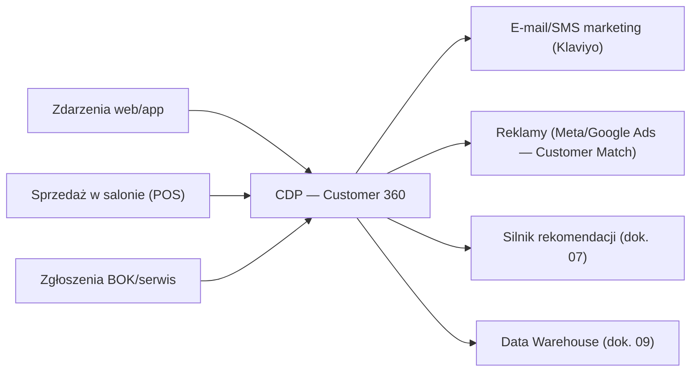

# 08 — CRM, automatyzacja marketingu i lojalność

[← Wróć do indeksu](../README.md)

## 8.1 Customer Data Platform (CDP)

Wszystkie zdarzenia klienta (przeglądanie, koszyk, zakup, zgłoszenie serwisowe, kontakt z BOK) trafiają do CDP (np. Segment/mParticle lub warstwa event-based zbudowana na Kafka — dok. 03), tworząc **jednolity profil klienta (Customer 360)** wykorzystywany przez marketing, personalizację (dok. 07) i BOK.

## 8.2 Automatyzacja e-mail/SMS marketingu

| Flow | Wyzwalacz | Cel |
|---|---|---|
| Seria powitalna | Zapis do newslettera | Budowa relacji, kod rabatowy -10% na pierwsze zakupy |
| Odzyskiwanie koszyka (abandoned cart) | Koszyk nieaktywny 1h / 24h / 72h | 3-etapowa sekwencja e-mail + SMS z przypomnieniem i social proof |
| Przypomnienie o przeglądanym produkcie (browse abandonment) | Przeglądanie PDP bez dodania do koszyka | Retargeting e-mailowy z rekomendacją podobnych produktów |
| Potwierdzenie i śledzenie zamówienia | Zmiana statusu zamówienia | Transakcyjne, zintegrowane ze statusami BaseLinker (dok. 04) |
| Prośba o recenzję | 14 dni po dostawie | Budowa social proof, punkty lojalnościowe za recenzję |
| Win-back (reaktywacja) | Brak zakupu 90/180 dni | Dedykowana oferta reaktywacyjna |
| Cross-sell po zakupie | X dni po zakupie głównego produktu | Np. akcesoria do zakupionego e-bike, panel solarowy do stacji zasilania |
| Alert dostępności / spadku ceny | Produkt z wishlisty wraca na stan / cena spada | Powiadomienie push/e-mail |

Segmentacja RFM (Recency, Frequency, Monetary) oraz segmenty behawioralne (np. „zainteresowani e-bike, brak zakupu”, „klienci B2B”) budowane automatycznie w CDP i synchronizowane z platformą e-mail marketingu (Klaviyo/Salesforce Marketing Cloud).

## 8.3 Program lojalnościowy „Summit Club”

| Poziom | Warunek wejścia | Benefity |
|---|---|---|
| Explorer | Rejestracja konta | 1 pkt za każde 10 PLN wydane, urodzinowy kod rabatowy |
| Trailblazer | 3000 PLN wydane w 12 miesięcy | Darmowa dostawa standardowa, wcześniejszy dostęp do wyprzedaży |
| Summit | 10 000 PLN wydane w 12 miesięcy | Dedykowany opiekun klienta, darmowy przegląd serwisowy roweru raz w roku, zaproszenia na eventy testowe produktów |

- Punkty wymienne na kody rabatowe, wymieniane 1:1 lub gamifikowane (progi „odblokowujące” nagrody).
- Punkty przyznawane także za: napisanie recenzji, polecenie znajomego (program referral), udział w ankiecie NPS.

## 8.4 Program partnerski / afiliacyjny

- Platforma afiliacyjna (np. Partnerize/Tradedoubler lub własny moduł tracking linków) dla blogerów i influencerów outdoor.
- Prowizja stawkowa per kategoria (np. 5% e-bike, 8% akcesoria — niższa marża na produktach flagowych).
- Panel partnera z raportowaniem konwersji w czasie rzeczywistym, materiały marketingowe do pobrania (Media Kit — dok. 01).

## 8.5 Powiadomienia push i aplikacja mobilna (Faza 3)

- Web push (przypomnienia o koszyku, powrót produktu na stan) przez service worker (PWA).
- Push mobilny (React Native — dok. 03) po wdrożeniu aplikacji: statusy zamówień, oferty geolokalizowane („Jesteś blisko salonu w Krakowie — odbierz zamówienie dziś”).

## 8.6 Obsługa klienta (Customer Service)

- Zintegrowany helpdesk (Zendesk/Freshdesk) z pełnym kontekstem klienta z CDP (historia zamówień, zgłoszenia serwisowe) — brak potrzeby przełączania się między systemami przez agenta.
- SLA odpowiedzi: e-mail ≤ 24h, live chat ≤ 5 min w godzinach pracy, chatbot AI 24/7 dla pytań standardowych (dok. 07).
- Ankiety CSAT/NPS po zamknięciu zgłoszenia — wynik zasila dashboard zarządczy (dok. 09).
