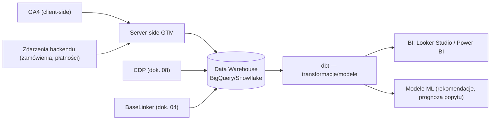

# 09 — Analityka, BI i testy A/B

[← Wróć do indeksu](../README.md)

## 9.1 Architektura danych analitycznych

- **Server-side Google Tag Manager** — dane wysyłane przez serwer własny (nie bezpośrednio z przeglądarki), co poprawia dokładność pomiaru (adblocki, ITP w Safari) i bezpieczeństwo danych (kontrola nad tym, co wysyłane jest do stron trzecich).
- **Data Warehouse** (BigQuery/Snowflake) jako centralne repozytorium — łączy dane z GA4, CDP, BaseLinker (zamówienia/magazyn) i ERP (finanse) w jeden model analityczny.
- **dbt (data build tool)** do wersjonowanych transformacji danych — modele: `fct_orders`, `fct_sessions`, `dim_customers`, `dim_products`.

## 9.2 Kluczowe wskaźniki (KPI Dashboard dla Zarządu)

| Kategoria | KPI | Definicja |
|---|---|---|
| Sprzedaż | Przychód, AOV (Average Order Value) | Łączny przychód / liczba zamówień |
| Konwersja | Conversion Rate (CR) | Zamówienia / sesje, per urządzenie i kanał |
| Koszyk | Cart Abandonment Rate | % koszyków utworzonych bez finalizacji zamówienia |
| Marketing | CAC (Customer Acquisition Cost), ROAS | Koszt marketingu / nowi klienci; przychód z reklam / wydatek na reklamę |
| Retencja | LTV (Customer Lifetime Value), Repeat Purchase Rate | Wartość klienta w czasie; % klientów z >1 zamówieniem |
| Obsługa | CSAT, NPS, czas rozwiązania zgłoszenia | Ankiety po kontakcie z BOK (dok. 08) |
| Logistyka | On-time delivery rate, koszt dostawy / zamówienie | % przesyłek dostarczonych w deklarowanym terminie |
| Techniczne | Core Web Vitals, uptime, error rate | Patrz dok. 03 i 11 |

Dashboard zarządczy (Looker Studio/Power BI) aktualizowany dziennie, z widokiem executive (miesięczne trendy) i operacyjnym (dzienne KPI dla zespołów).

## 9.3 Framework testów A/B i eksperymentów

| Element | Opis |
|---|---|
| Narzędzie | VWO / Optimizely / wewnętrzny framework na feature flags (LaunchDarkly — dok. 03) |
| Governance eksperymentów | Rejestr eksperymentów (hipoteza, metryka sukcesu, wielkość próby, czas trwania) zatwierdzany przez Product Ownera przed startem |
| Istotność statystyczna | Minimalna wielkość próby wyliczana przed testem (power analysis), próg istotności p < 0.05 |
| Przykładowe obszary testowania | Layout PDP (pozycja CTA, galeria vs wideo), komunikaty darmowej dostawy, kolejność kroków checkout, treść e-maili odzyskiwania koszyka |
| Segmentacja wyników | Wyniki analizowane per urządzenie, nowy/powracający klient, kanał akwizycji — unikanie błędnych wniosków z uśrednionych danych (Simpson's paradox) |

## 9.4 Raportowanie i atrybucja marketingowa

- **Multi-touch attribution** — model danych łączący GA4, dane CDP i platformy reklamowe, aby ocenić rzeczywisty wpływ każdego kanału (nie tylko last-click).
- **Cohort analysis** — analiza retencji i LTV per kohorta akwizycyjna (miesiąc pierwszego zakupu), kluczowa dla oceny ROI kampanii sezonowych.
- **Prognozowanie popytu (Faza 3):** model ML na danych historycznych sprzedaży + sezonowość, wspierający planowanie zakupów/stanów magazynowych (integracja z BaseLinker — dok. 04).
- **Data governance:** dostęp do danych wg roli (RBAC w BI), maskowanie PII w warstwie raportowej, zgodność z RODO (dok. 06) przy eksportach danych klientów do narzędzi analitycznych.
