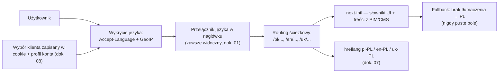

# 13 — Wielojęzyczność (PL/EN/UK) i kompatybilność wielourządzeniowa

[← Wróć do indeksu](../README.md)

Summit & Trail startuje jako serwis **trójjęzyczny od dnia pierwszego** — polski, angielski i ukraiński — oraz w pełni responsywny na każdym urządzeniu (telefon, tablet, komputer). To odróżnia ten wymóg od ekspansji rynkowej opisanej w [dokumencie 10](10-b2b-ekspansja-miedzynarodowa.md): tam mówimy o **nowych rynkach** (Niemcy, Czechy) z osobną domeną, walutą i logistyką. Tutaj mówimy o **jednym rynku polskim**, obsługiwanym w trzech językach dla trzech realnych grup klientów tego samego sklepu:

| Język | Grupa odbiorców | Uzasadnienie biznesowe |
|---|---|---|
| Polski (PL) | Klienci krajowi | Język domyślny, wersja prawnie wiążąca regulaminu |
| Angielski (EN) | Ekspaci, turyści, klienci B2B zagraniczni kupujący z Polski | Standard w e-commerce premium/outdoor, wymagany przez część klientów korporacyjnych (dok. 10) |
| Ukraiński (UK) | Duża społeczność ukraińska mieszkająca w Polsce | Realny, duży segment klientów — obsługa w języku ojczystym istotnie zwiększa konwersję i zaufanie |

Waluta pozostaje **PLN** we wszystkich trzech wersjach językowych (to nie jest zmiana rynku, tylko zmiana języka interfejsu) — inaczej niż w scenariuszu ekspansji z dok. 10, gdzie zmienia się też rynek, waluta i logistyka.

## 13.1 Architektura techniczna wielojęzyczności

- **Struktura URL:** ścieżkowa (`summitandtrail.pl/pl/...`, `/en/...`, `/uk/...`), jedna domena — prostsze SEO (jeden domain authority) i prostsza obsługa niż subdomeny/ccTLD używane przy ekspansji rynkowej (dok. 10).
- **Wykrywanie języka:** nagłówek `Accept-Language` przeglądarki + opcjonalny GeoIP jako podpowiedź, zawsze z możliwością manualnej zmiany — wybór klienta zapisywany trwale (cookie + profil konta, dok. 08), nigdy nie jest wymuszany ponownie.
- **Fallback tłumaczeń:** brak tłumaczenia danego pola (np. nowy artykuł blogowy jeszcze nieprzetłumaczony) nigdy nie pokazuje pustego miejsca — system automatycznie pokazuje wersję polską z dyskretną etykietą „treść dostępna po polsku”, nigdy błąd czy puste UI.
- **Cyrylica:** dobór fontów webowych z pełnym pokryciem znaków cyrylicy (nie tylko łacińskich) i testy renderowania długich słów ukraińskich w elementach o ograniczonej szerokości (przyciski, etykiety produktów).

## 13.2 Zakres tłumaczenia treści

| Warstwa | Podejście |
|---|---|
| UI aplikacji (przyciski, formularze, komunikaty błędów) | Tłumaczenie profesjonalne + przegląd native speakera przed publikacją |
| Opisy produktów i SEO (dok. 02) | Wstępne tłumaczenie przez Summit AI Content Studio (dok. 12) + obowiązkowa redakcja native speakera — nigdy publikacja czysto maszynowa bez przeglądu człowieka |
| Regulamin, polityka prywatności, formularz odstąpienia (dok. 06) | Tłumaczenie profesjonalne (prawnicze) na EN/UK; **wersja polska jest prawnie wiążąca** — jasna adnotacja w wersjach EN/UK („w razie sporu obowiązuje wersja polska”) |
| Faktury | Wystawiane po polsku zgodnie z polskim prawem podatkowym; opcjonalny angielski/ukraiński opis pozycji jako pomoc, nie substytut |
| E-maile transakcyjne i marketingowe (dok. 08) | Wysyłane w języku wybranym przez klienta w profilu — szablony w 3 wersjach w platformie marketing automation |
| Obsługa klienta / BOK (dok. 08) | Agenci obsługujący PL/EN/UK (rekrutacja z uwzględnieniem języka ukraińskiego), Summit AI Assistant (dok. 12) natywnie wielojęzyczny |
| Etykiety kurierskie i dokumenty przewozowe (dok. 04, 05) | Zawsze po polsku (wymóg operacyjny przewoźników krajowych) |

### Governance tłumaczeń

- **Translation Management System** (Lokalise/Crowdin) zintegrowany z CI/CD (dok. 03) — nowe klucze tekstowe w kodzie automatycznie trafiają do kolejki tłumaczeń; wdrożenie na produkcję krytycznych ścieżek (checkout, płatność) blokowane, jeśli tłumaczenie EN/UK nie jest gotowe i zatwierdzone.
- **Translation memory i słownik terminologii** (np. „rama”, „słup wodny”, „stacja zasilania”) — spójność terminów technicznych między produktami, blogiem i BOK.
- **Dashboard kompletności tłumaczeń** — widoczny dla zespołu contentowego procent przetłumaczonych/zatwierdzonych treści per język, priorytetyzacja wg ruchu (najpierw najczęściej odwiedzane PDP).

## 13.3 Kompatybilność wielourządzeniowa (Responsive & Cross-Platform)

Serwis projektowany **mobile-first**, z pełną parytetowością funkcjonalną między telefonem, tabletem i komputerem — żadna funkcja (checkout, konfigurator, panel B2B) nie jest dostępna tylko na jednym typie urządzenia.

### Breakpointy i zasady layoutu

| Breakpoint | Zakres | Układ |
|---|---|---|
| Mobile S | 360–479 px | Nawigacja dolna (bottom nav), 1 kolumna, mega menu jako pełnoekranowy akordeon |
| Mobile L | 480–767 px | Jak wyżej, większe miniatury produktowe |
| Tablet | 768–1023 px | 2–3 kolumny listingu, mega menu jako dropdown |
| Desktop | 1024–1439 px | Pełne mega menu, 4 kolumny listingu, sticky search bar |
| Desktop XL | ≥ 1440 px | Layout z ograniczoną max-width treści (czytelność), dodatkowe sekcje rekomendacji |

- **Touch targets:** min. 44×44 px dla elementów klikalnych na dotyk (zgodność z WCAG 2.1 AA, dok. 06).
- **Gesty:** swipe w galerii zdjęć produktowych i w konfiguratorze (dok. 12), pull-to-refresh w panelu zamówień.
- **PWA (Progressive Web App):** manifest + service worker — instalacja „Dodaj do ekranu głównego”, działanie offline dla przeglądanych wcześniej stron (dok. 03), powiadomienia push (dok. 08).
- **Aplikacja natywna (Faza 3, dok. 03/08):** React Native — współdzielony design system z wersją web, dostęp do funkcji sprzętowych (skanowanie kodów rabatowych, powiadomienia geolokalizowane).

### Uwaga na wielojęzyczność w layoucie

Teksty ukraińskie i polskie bywają istotnie dłuższe niż angielskie (np. nazwy kategorii, etykiety filtrów) — komponenty UI projektowane z elastyczną szerokością (nie hard-coded px dla tekstu), testowane wizualnie w każdym z 3 języków na każdym breakpoincie, aby uniknąć obcinania tekstu lub rozjeżdżania layoutu.

## 13.4 Testowanie kompatybilności

| Wymiar testów | Zakres |
|---|---|
| Urządzenia | iPhone (SE, 14/15), popularne Android (Samsung Galaxy A/S), iPad, laptop Windows/macOS — emulowane w Playwright + realne urządzenia w cloud device farm (BrowserStack/Sauce Labs) |
| Przeglądarki | Chrome, Safari (iOS i macOS), Firefox, Edge, Samsung Internet — matrix testów regresyjnych w CI/CD (dok. 03) |
| Języki × breakpointy | Testy wizualnej regresji (Percy/Chromatic) dla każdej kombinacji języka (PL/EN/UK) i głównego breakpointu na kluczowych ekranach (PDP, listing, checkout) |
| Warunki sieciowe | Throttling 3G/4G w testach wydajności mobilnej — utrzymanie budżetu Core Web Vitals (dok. 03) także w słabszych warunkach sieciowych |
| Dostępność | Audyt axe-core per język (etykiety ARIA i komunikaty błędów też muszą być przetłumaczone i poprawnie wymawiane przez czytniki ekranu) — zgodność z dok. 06 |

## 13.5 Konsekwencje dla SEO i AI

- **hreflang** dla wszystkich trzech wersji (`pl-PL`, `en-PL`, `uk-PL`) na każdej stronie kategorii/PDP/artykule — pełna implementacja opisana w [dokumencie 07](07-seo-marketing-personalizacja-ai.md).
- **Summit AI Assistant i wyszukiwanie semantyczne** (dok. 12) działają natywnie w PL/EN/UK — klient pisze pytanie w swoim języku, otrzymuje odpowiedź w tym samym języku, niezależnie od języka źródłowego danych w PIM.
- **Osobne indeksowanie treści blogowych** per język — nie tłumaczenie „na sztywno” każdego artykułu, ale strategia contentowa uwzględniająca różnice w wyszukiwanych frazach między językami (dok. 07).
