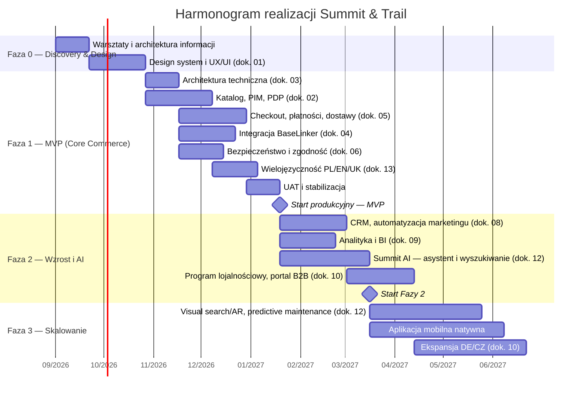

# 14 — Harmonogram wdrożenia i kosztorys projektu

[← Wróć do indeksu](../README.md)

Poniższy harmonogram i kosztorys mają charakter **orientacyjny** — punkt wyjścia do rozmowy z Klientem, doprecyzowywany po wyborze konkretnych dostawców (CMS, PIM, bramek płatności, dostawcy AI) i ostatecznego zakresu Fazy 1. Ceny podane w PLN netto, stawki rynkowe dla polskiego zespołu software house/agencji e-commerce (2026).

## 14.1 Model realizacji — fazowanie projektu

Projekt realizowany w modelu przyrostowym: każda faza kończy się działającym, wdrożonym produktem (nie „big bang" po 12 miesiącach), zgodnie z priorytetami MVP/Faza 2/Faza 3 zdefiniowanymi w [dokumencie 01](01-mapa-strony-ux-ia.md).

| Faza | Zakres | Czas trwania |
|---|---|---|
| Faza 0 — Discovery & Design | Warsztaty z Klientem, architektura informacji (dok. 01), design system, makiety UX/UI | 6–8 tygodni |
| Faza 1 — MVP | Katalog, PDP, checkout, płatności, BaseLinker, bezpieczeństwo podstawowe, PL/EN/UK, responsywność (dok. 02–06, 13) | 4–5 miesięcy |
| Faza 2 — Wzrost i AI | CRM/marketing automation, BI, Summit AI (asystent, wyszukiwanie, rekomendacje), loyalty, fundamenty B2B (dok. 08, 09, 10, 12) | 3–4 miesiące |
| Faza 3 — Skalowanie | AI zaawansowane (visual search/AR, predictive maintenance), aplikacja mobilna, ekspansja międzynarodowa (dok. 10, 12) | Roadmap ciągły, 6+ miesięcy |

**Czas do pierwszego uruchomienia produkcyjnego (Faza 0 + Faza 1): ok. 6–7 miesięcy.**

## 14.2 Struktura zespołu projektowego

| Rola | Zaangażowanie | Odpowiedzialność |
|---|---|---|
| Project Manager / Product Owner | 100%, cały projekt | Priorytetyzacja backlogu, komunikacja z Klientem, zarządzanie ryzykiem |
| Architekt rozwiązania / Tech Lead | 100% w Fazie 0–1, 50% dalej | Architektura techniczna (dok. 03), decyzje technologiczne, code review |
| UX/UI Designer | 100% w Fazie 0, 30% dalej | Design system, makiety, testy użyteczności (dok. 13) |
| Deweloperzy Frontend (2–3) | 100% | Next.js, komponenty, i18n (dok. 13), integracja z API |
| Deweloperzy Backend (2–3) | 100% | Mikroserwisy, integracje (dok. 04), logika cenowa/logistyczna (dok. 05) |
| DevOps / SRE | 50–70% | CI/CD, infrastruktura, monitoring (dok. 03, 11) |
| Specjalista QA | 70–100% | Testy manualne/automatyczne, matrix urządzeń (dok. 13) |
| Specjalista bezpieczeństwa (konsultacyjnie) | Punktowo (audyt, pentest) | Zgodność, testy penetracyjne (dok. 06) |
| Data/ML Engineer | Od Fazy 2, 100% | Platforma MLOps, modele rekomendacji, Summit AI (dok. 12) |
| Content/SEO Specialist + tłumacze PL/EN/UK | Od Fazy 0, 50–70% | Treści produktowe, blog, tłumaczenia i governance (dok. 02, 07, 13) |
| Specjalista marketing automation | Od Fazy 2, 50% | CRM, flow e-mail/SMS, program lojalnościowy (dok. 08) |

Łączny zespół: **6–8 osób w Fazie 1**, rozrastający się do **10–12 osób w Fazie 2** wraz z uruchomieniem strumienia AI/ML i marketing automation.

## 14.3 Kosztorys — Faza 0 i Faza 1 (do startu produkcyjnego)

| Obszar | Zakres kosztowy (PLN netto) | Uwagi |
|---|---|---|
| Discovery, UX/UI, design system (Faza 0) | 60 000 – 90 000 | Warsztaty, makiety high-fidelity, biblioteka komponentów |
| Architektura techniczna i DevOps setup | 50 000 – 80 000 | Infrastruktura cloud, CI/CD, środowiska (dok. 03) |
| Katalog, PIM, PDP, wyszukiwanie podstawowe | 120 000 – 180 000 | Wraz z konfiguracją PIM i indeksu wyszukiwania (dok. 02) |
| Checkout, płatności, logistyka | 100 000 – 150 000 | Integracja PayU/Przelewy24, kurierzy, reguły koszyka (dok. 05) |
| Integracja BaseLinker | 60 000 – 100 000 | WMS/OMS, automatyzacje, marketplace (dok. 04) |
| Bezpieczeństwo i zgodność prawna | 40 000 – 70 000 | WAF, nagłówki, RODO/Omnibus, pierwszy audyt (dok. 06) |
| Wielojęzyczność PL/EN/UK + responsywność | 50 000 – 80 000 | i18n, tłumaczenia startowe, testy cross-device (dok. 13) |
| Zarządzanie projektem i QA (cała Faza 1) | 80 000 – 120 000 | PM, testy, UAT |
| **Suma orientacyjna Faza 0 + Faza 1** | **560 000 – 870 000 PLN netto** | Jednorazowy koszt wdrożenia do startu produkcyjnego |

### Faza 2 — Wzrost i AI (orientacyjnie)

| Obszar | Zakres kosztowy (PLN netto) |
|---|---|
| CRM, marketing automation, program lojalnościowy | 90 000 – 140 000 |
| Analityka, BI, data warehouse | 70 000 – 110 000 |
| Summit AI — asystent, wyszukiwanie semantyczne, rekomendacje, platforma MLOps (dok. 12) | 200 000 – 320 000 |
| Fundamenty B2B | 60 000 – 100 000 |
| **Suma orientacyjna Faza 2** | **420 000 – 670 000 PLN netto** |

## 14.4 Koszty operacyjne (utrzymanie — miesięcznie, po starcie)

| Pozycja | Koszt miesięczny (orientacyjny) | Uwagi |
|---|---|---|
| Infrastruktura cloud (compute, baza danych, storage) | 3 000 – 8 000 PLN | Skaluje się z ruchem, wyższe w okresach kampanii |
| Cloudflare (WAF, CDN) — plan Business/Enterprise | 1 000 – 5 000 PLN | Zależnie od poziomu ochrony i ruchu |
| BaseLinker — abonament | 200 – 600 PLN | Zależnie od liczby zamówień/kont |
| Wyszukiwanie (Algolia) | 500 – 3 000 PLN | Zależnie od liczby zapytań/indeksowanych rekordów |
| Platforma marketing automation (Klaviyo i podobne) | 1 000 – 4 000 PLN | Zależnie od bazy kontaktów |
| Inferencja modeli AI (LLM API — Summit AI) | 2 000 – 15 000 PLN | Silnie zależne od skali ruchu w asystencie/generowaniu treści (dok. 12) — monitorowane w budżecie MLOps |
| Monitoring/observability (Datadog/Sentry) | 1 000 – 3 000 PLN | Zależnie od wolumenu logów/zdarzeń |
| Narzędzie do tłumaczeń (TMS) | 300 – 800 PLN | Zależnie od liczby słów/języków (dok. 13) |
| Domena, certyfikaty, poczta transakcyjna | 200 – 500 PLN | — |
| **Suma orientacyjna utrzymania** | **9 200 – 39 900 PLN/miesiąc** | Dolny zakres = start MVP, górny = pełna skala z Fazy 2 |

Prowizje bramek płatności (PayU/Przelewy24) i przewoźników rozliczane transakcyjnie (% od wartości zamówienia), nie jako stały koszt miesięczny — patrz [dokument 05](05-logistyka-dostawy-platnosci.md).

## 14.5 Model rozliczenia i kamienie płatności

| Kamień płatności | % wartości Fazy | Warunek wypłaty |
|---|---|---|
| Podpisanie umowy | 20% | Start prac, rezerwacja zespołu |
| Akceptacja design systemu i architektury technicznej | 20% | Zatwierdzenie makiet UX/UI i dokumentu architektury (dok. 03) przez Klienta |
| Zakończenie prac deweloperskich Fazy 1 | 30% | Wdrożenie na środowisko staging, gotowość do UAT |
| Uruchomienie produkcyjne (go-live) | 20% | Pozytywne UAT (dok. 03/13), przejście checklisty wdrożenia (dok. 11) |
| Stabilizacja po starcie (30 dni) | 10% | Brak krytycznych incydentów (SEV1/SEV2, dok. 11), przekazanie dokumentacji operacyjnej |

Faza 2 rozliczana analogicznie (kamienie co 4–6 tygodni) lub w modelu Time & Material z miesięcznym raportowaniem — do ustalenia z Klientem w zależności od preferowanego modelu współpracy (fixed price vs T&M).

## 14.6 Rejestr ryzyk projektowych

| Ryzyko | Wpływ | Mitygacja |
|---|---|---|
| Opóźnienia integracji z BaseLinker/kurierami (zależność od dostawcy zewnętrznego) | Średni–Wysoki | Wczesny start integracji równolegle z UI (dok. 04), środowisko sandbox dostawców od pierwszego tygodnia |
| Scope creep na funkcjach AI (dok. 12) | Wysoki | Jasny podział MVP asystenta (odpowiedzi na bazie FAQ/katalogu) vs zaawansowane funkcje (visual search, predictive maintenance) w Fazie 3 |
| Wąskie gardło w tłumaczeniach PL/EN/UK (jakość, tempo) | Średni | Governance i TMS od Fazy 0 (dok. 13), praca równoległa native speakerów z deweloperami |
| Nieprzewidziany wzrost kosztów inferencji AI przy skalowaniu ruchu | Średni | Cache semantyczny, limity budżetowe per funkcja, monitoring kosztów w MLOps (dok. 12) |
| Niedotrzymanie terminu przed sezonem szczytowym (np. wiosna dla rowerów) | Wysoki | Harmonogram odwrócony od daty sezonu, bufor 3–4 tygodni przed krytycznym terminem |
| Vendor lock-in na pojedynczym dostawcy | Niski–Średni | Architektura composable/MACH (dok. 03) — wymienność komponentów bez przepisywania całości |
| Niezgodność z RODO/Omnibus/AI Act wykryta po starcie | Wysoki | Audyt zgodności jako formalny krok akceptacyjny przed go-live (dok. 06, 12), nie działanie „po fakcie” |
