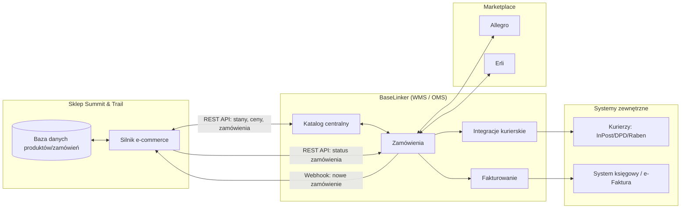

# Summit & Trail — Specyfikacja Funkcjonalna (Functional Specification Document)

| | |
|---|---|
| **Projekt** | Summit & Trail — sklep e-commerce (e-rowery, sprzęt outdoor, biwak) |
| **Wersja dokumentu** | 1.0 |
| **Data** | 2026-07-30 |
| **Status** | Projekt wykonawczy — do akceptacji Klienta |
| **Autor** | Architekt E-commerce / Senior Web Developer |

---

## Spis treści

1. [Struktura produktowa i dane demo](#1-struktura-produktowa-i-dane-demo)
2. [Integracja z BaseLinker (WMS & Marketplace)](#2-integracja-z-baselinker-wms--marketplace)
3. [Metody dostawy i płatności (logistyka)](#3-metody-dostawy-i-płatności-logistyka)
4. [Architektura bezpieczeństwa (Security & Compliance)](#4-architektura-bezpieczeństwa-security--compliance)
5. [Domena, serwer i konfiguracja DNS](#5-domena-serwer-i-konfiguracja-dns)

---

## 1. Struktura produktowa i dane demo

Poniżej trzy w pełni rozbudowane karty produktowe, reprezentujące trzy kluczowe kategorie asortymentu. Każda karta zawiera dane identyfikacyjne, treść SEO, specyfikację techniczną, warianty oraz dane logistyczne (VAT, waga, gabaryt) niezbędne do konfiguracji sklepu i integracji z BaseLinker.

### 1.1 Produkt: E-Bike Trekkingowy — „Summit & Trail Ranger X1”

**Kategoria:** E-Rowery / E-Bike Trekkingowy
**SKU (produkt bazowy):** `SNT-EBK-RGX1`
**EAN (przykładowy, wariant bazowy M/Czarny):** `5906190000117`

#### Opis marketingowy (SEO)

## Ranger X1 — trekkingowy e-bike, który przewiezie Cię dalej, niż myślisz

Summit & Trail Ranger X1 to elektryczny rower trekkingowy zaprojektowany dla osób, które nie dzielą przygody na „miasto” i „szlak”. Silnik środkowy 250W, bateria do 720 Wh i geometria trekkingowa sprawiają, że Ranger X1 równie dobrze radzi sobie w dojazdach do pracy, jak i na wielodniowych wyprawach z bagażem.

### Zasięg, który nie ogranicza planów

Dzięki akumulatorowi zintegrowanemu w ramie (opcja 500 Wh lub 720 Wh) Ranger X1 pokonuje nawet **130 km** na jednym ładowaniu w trybie Eco. To realny zasięg trasy Warszawa–Łódź bez ładowania w trakcie.

### Napęd Bosch Performance Line — moc i precyzja

Środkowy silnik Bosch klasy Performance Line (250 W, 65 Nm) współpracuje z 10-biegową kasetą Shimano Deore, zapewniając płynne przejścia mocy niezależnie od nachylenia terenu.

### Bezpieczeństwo na pierwszym miejscu

Hydrauliczne tarczowe hamulce Shimano MT200 oraz oświetlenie zintegrowane z instalacją elektryczną (przód/tył) sprawiają, że Ranger X1 spełnia wymagania homologacyjne do jazdy po zmroku zgodnie z Prawem o ruchu drogowym.

#### Opis techniczny — tabela specyfikacji

| Parametr | Wartość |
|---|---|
| Typ napędu | Silnik środkowy Bosch Performance Line, 250 W, 65 Nm |
| Bateria | Bosch PowerTube, 500 Wh / 720 Wh (wariant) |
| Zasięg (tryb Eco) | do 130 km (720 Wh) / do 90 km (500 Wh) |
| Czas ładowania (0–100%) | 4,5 h (standardowa ładowarka 4A) |
| Rama | Aluminium 6061, trekking, rozmiary S/M/L/XL |
| Napęd (przerzutki) | Shimano Deore 10-rz. |
| Hamulce | Hydrauliczne tarczowe Shimano MT200, tarcze 180 mm |
| Koła | 28″, obręcze aluminiowe, opony przeciwprzebiciowe Schwalbe Marathon |
| Oświetlenie | LED przód/tył, zintegrowane z akumulatorem |
| Maks. obciążenie (rower + bagaż) | 150 kg |
| Klasa wsparcia | Do 25 km/h (zgodnie z UE, kategoria e-bike bez homologacji jako pojazd) |
| Waga roweru | 24,8 kg (wariant 500 Wh) / 25,6 kg (wariant 720 Wh) |

#### Warianty produktu

| Atrybut wariantu | Opcje |
|---|---|
| Rozmiar ramy | S (46 cm) / M (50 cm) / L (54 cm) / XL (58 cm) |
| Kolor | Czarny Grafit / Zielony Leśny |
| Pojemność baterii | 500 Wh / 720 Wh |

Łącznie: 4 (rozmiary) × 2 (kolory) × 2 (baterie) = **16 aktywnych SKU** dla tego modelu.

Przykładowe SKU wariantów:
- `SNT-EBK-RGX1-M-BLK-500` — EAN `5906190000117`
- `SNT-EBK-RGX1-M-BLK-720` — EAN `5906190000124`
- `SNT-EBK-RGX1-L-GRN-720` — EAN `5906190000131`

#### Dane podatkowe i logistyczne

| Parametr | Wartość |
|---|---|
| Stawka VAT | 23% |
| Cena netto | 8 943,09 PLN |
| Cena brutto | 11 000,00 PLN |
| Waga netto (produkt) | 25,6 kg |
| Waga brutto (z opakowaniem) | 29,5 kg |
| Wymiary opakowania (dł. × szer. × wys.) | 145 × 25 × 85 cm |
| Typ przesyłki | **Gabarytowa / paletowa** (przewoźnik: Raben, DHL Freight) |
| Kod PKWiU/CN (do faktur i deklaracji celnych) | CN 8711 60 10 |

---

### 1.2 Produkt: Namiot Dachowy — „Summit & Trail SkyNest 3”

**Kategoria:** Kamping / Namiot Dachowy
**SKU (produkt bazowy):** `SNT-TNT-SKN3`
**EAN (przykładowy, wariant bazowy Piaskowy):** `5906190000148`

#### Opis marketingowy (SEO)

## SkyNest 3 — Twój hotel na czterech kołach, gdziekolwiek zaparkujesz

Namiot dachowy Summit & Trail SkyNest 3 zmienia dach każdego SUV-a, kombi czy pickupa w wygodną sypialnię z widokiem. Rozkładany w mniej niż 3 minuty, mieści do 3 osób i zapewnia dystans od wilgoci, zimna gruntu oraz owadów.

### Rozstaw w 3 minuty, bez narzędzi

Konstrukcja typu hard-shell na zawiasie gazowym otwiera się jednym ruchem. Wbudowana drabinka aluminiowa teleskopowa (regulacja 190–230 cm) pozwala dopasować wejście do wysokości bagażnika.

### Materiały klasy premium na trudne warunki

Poszycie z tkaniny bawełniano-poliestrowej (Rip-Stop, 280 g/m², natłuszczanej) zapewnia oddychalność przy pełnej wodoodporności **5000 mm słupa wody**. Wzmocnione szwy taśmowane termicznie eliminują przecieki na styku materiałów.

### Wygoda, o której nie musisz myśleć

Materac piankowy wysokiej gęstości (7,5 cm) wchodzi w skład zestawu — SkyNest 3 to gotowe do spania rozwiązanie od pierwszej minuty po otwarciu skorupy.

#### Opis techniczny — tabela specyfikacji

| Parametr | Wartość |
|---|---|
| Pojemność | 2–3 osoby |
| Materiał poszycia | Bawełna/poliester Rip-Stop 280 g/m², natłuszczana |
| Słup wodny | 5000 mm |
| Skorupa (shell) | ABS wzmacniane włóknem szklanym |
| Materac | Piana wysokiej gęstości, 7,5 cm |
| Drabinka | Aluminiowa teleskopowa, 190–230 cm |
| Czas montażu | ok. 2–3 minuty (otwarcie), 5 minut (złożenie) |
| Wymiary złożony (dł. × szer. × wys.) | 210 × 130 × 30 cm |
| Wymiary rozłożony (dł. × szer.) | 210 × 240 cm |
| System mocowania | Bagażnik dachowy z belkami, obciążenie dynamiczne do 75 kg |
| Wentylacja | 2 okna moskitierowe + wywietrznik szczytowy |
| Zakres temperatur eksploatacji | -10°C do +40°C |
| Waga | 58 kg |

#### Warianty produktu

| Atrybut wariantu | Opcje |
|---|---|
| Kolor poszycia | Piaskowy (Sand) / Oliwkowy (Olive) |
| Pojemność / rozmiar | 2-osobowy (SkyNest 2) / 3-osobowy (SkyNest 3) |
| Materac dodatkowy (akcesorium) | Standard / Zimowy (pogrubiony, 10 cm) |

Przykładowe SKU wariantów:
- `SNT-TNT-SKN3-SAND` — EAN `5906190000148`
- `SNT-TNT-SKN3-OLIVE` — EAN `5906190000155`
- `SNT-TNT-SKN2-SAND` — EAN `5906190000162`

#### Dane podatkowe i logistyczne

| Parametr | Wartość |
|---|---|
| Stawka VAT | 23% |
| Cena netto | 6 504,07 PLN |
| Cena brutto | 8 000,00 PLN |
| Waga netto (produkt) | 58 kg |
| Waga brutto (z opakowaniem) | 64 kg |
| Wymiary opakowania (dł. × szer. × wys.) | 215 × 135 × 35 cm |
| Typ przesyłki | **Gabarytowa / paletowa** (przewoźnik: Raben, DHL Freight) |
| Kod PKWiU/CN | CN 6306 22 00 |

---

### 1.3 Produkt: Przenośna Stacja Zasilania — „Summit & Trail PowerBase 1000”

**Kategoria:** Elektronika Outdoor / Przenośna Stacja Zasilania
**SKU (produkt bazowy):** `SNT-PWR-PB1000`
**EAN (przykładowy, wariant bazowy 1000 Wh):** `5906190000179`

#### Opis marketingowy (SEO)

## PowerBase 1000 — energia elektryczna wszędzie, gdzie zabierze Cię szlak

Summit & Trail PowerBase 1000 to przenośna stacja zasilania na ogniwach LiFePO4, zaprojektowana do zasilania sprzętu biwakowego, lodówek turystycznych, laptopów i drobnej elektroniki podczas wielodniowych wyjazdów bez dostępu do sieci.

### Ogniwa LiFePO4 — 3500+ cykli ładowania

W przeciwieństwie do tańszych stacji na ogniwach NMC, PowerBase 1000 wykorzystuje chemię LiFePO4, gwarantującą ponad 3500 cykli pełnego ładowania przy zachowaniu 80% pojemności — to ekwiwalent ponad 10 lat użytkowania sezonowego.

### Ładowanie z trzech źródeł równocześnie

Gniazdo AC 230V, wejście solarowe (panele fotowoltaiczne Summit & Trail SolarFlex, do 200 W) oraz ładowanie z gniazda 12V w samochodzie — PowerBase 1000 uzupełnia energię tam, gdzie akurat jesteś.

### Zasilanie bezprzerwowe dla sprzętu wrażliwego

Wbudowany moduł UPS (przełączanie <20 ms) pozwala wykorzystać PowerBase 1000 jako zasilanie awaryjne dla routera, monitoringu czy sprzętu medycznego w warunkach domowych.

#### Opis techniczny — tabela specyfikacji

| Parametr | Wartość |
|---|---|
| Pojemność | 1024 Wh (LiFePO4) |
| Moc wyjściowa (ciągła / szczytowa) | 1200 W / 2400 W |
| Porty wyjściowe | 2× AC 230V, 2× USB-A (18W), 2× USB-C PD (100W), 1× DC 12V |
| Wejście ładowania | AC (230V), Solar (MC4, 12–28V, max 200W), Samochodowe 12V |
| Czas ładowania AC (0–80%) | 50 minut |
| Czas ładowania solar (panel 200W) | ok. 6 godzin |
| Żywotność ogniw | > 3500 cykli do 80% pojemności |
| Wyświetlacz | LCD, moc wejścia/wyjścia w czasie rzeczywistym |
| Zabezpieczenia | Przeciążeniowe, przeciwzwarciowe, nadtemperaturowe, BMS |
| Waga | 12,8 kg |
| Wymiary | 32 × 22 × 24 cm |

#### Warianty produktu

| Atrybut wariantu | Opcje |
|---|---|
| Pojemność baterii | 1024 Wh / 1500 Wh |
| Zestaw | Stacja sama / Stacja + panel solarowy SolarFlex 100W / Stacja + panel SolarFlex 200W |

Przykładowe SKU wariantów:
- `SNT-PWR-PB1000-SOLO` — EAN `5906190000179`
- `SNT-PWR-PB1000-SF100` — EAN `5906190000186`
- `SNT-PWR-PB1500-SOLO` — EAN `5906190000193`

#### Dane podatkowe i logistyczne

| Parametr | Wartość |
|---|---|
| Stawka VAT | 23% |
| Cena netto | 3 252,03 PLN |
| Cena brutto | 4 000,00 PLN |
| Waga netto (produkt) | 12,8 kg |
| Waga brutto (z opakowaniem) | 14,5 kg |
| Wymiary opakowania (dł. × szer. × wys.) | 38 × 28 × 30 cm |
| Typ przesyłki | **Standardowa** (kurier/paczkomat — spełnia limity gabarytowe) |
| Kod PKWiU/CN | CN 8507 60 00 |
| Uwaga transportowa | Ogniwa LiFePO4 — towar w klasie UN3480/UN3481 (baterie litowe); wymagana deklaracja przewozowa zgodna z ADR/IATA dla przewoźnika |

---

## 2. Integracja z BaseLinker (WMS & Marketplace)

### 2.1 Architektura ogólna

BaseLinker działa jako centralny hub WMS/OMS pomiędzy sklepem Summit & Trail, kurierami, systemem fakturowania i marketplace'ami. Sklep nigdy nie komunikuje się bezpośrednio z Allegro/Erli — całą logikę multi-channel przejmuje BaseLinker.



### 2.2 Dwukierunkowa synchronizacja

| Przepływ | Kierunek | Mechanizm | Częstotliwość |
|---|---|---|---|
| Stany magazynowe | Sklep ⇄ BaseLinker | REST API (`productUpdateStock` / `productsGetList`) + webhook `order_status_changed` | Real-time (webhook) + sync co 5 min (fallback cron) |
| Ceny (w tym promocje) | Sklep ⇄ BaseLinker | REST API (`productUpdatePrices`) | Real-time przy zapisie w PIM sklepu |
| Zamówienia | BaseLinker → Sklep (status) / Sklep → BaseLinker (nowe zamówienie) | Webhook (`newOrder`) do BaseLinker przy złożeniu zamówienia w sklepie; webhook `order_status_change` z BaseLinkera do sklepu | Real-time |
| Dokumenty (faktury, etykiety) | BaseLinker → Sklep | REST API (`getOrderInvoice`, `getLabel`) — link/pliki wypychane do panelu klienta | Real-time po wygenerowaniu w BL |

**Zasada projektowa:** BaseLinker jest „source of truth” dla stanów magazynowych łączonych (wiele kanałów sprzedaży współdzieli ten sam magazyn), sklep własny jest „source of truth” dla treści produktowych (opisy, zdjęcia, SEO).

#### Przykładowy payload webhooka (BaseLinker → Sklep), zmiana statusu zamówienia

```json
{
  "event": "order_status_changed",
  "order_id": 2024113001,
  "order_source": "shop",
  "old_status_id": 91827,
  "new_status_id": 91830,
  "new_status_name": "Wysłane",
  "timestamp": 1785432000
}
```

#### Przykładowe wywołanie API sklep → BaseLinker (aktualizacja stanu)

```json
POST https://api.baselinker.com/connector.php
Headers:
  X-BLToken: {{BASELINKER_API_TOKEN}}
  Content-Type: application/x-www-form-urlencoded

Body:
  method=productUpdateStock
  parameters={
    "storage_id": "bl_1",
    "product_id": "SNT-EBK-RGX1-M-BLK-720",
    "variant_id": "12345",
    "stock": {
      "bl_1": 14
    }
  }
```

### 2.3 Automatyzacje akcji w BaseLinkerze

Konfiguracja w module **Automatyczne akcje** (BaseLinker → Zamówienia → Automatyczne akcje):

| # | Wyzwalacz | Warunek | Akcja |
|---|---|---|---|
| 1 | Zmiana statusu zamówienia → **„Do wysłania”** | Zamówienie opłacone (status płatności = zaksięgowana) | Automatyczne wygenerowanie i pobranie etykiety kurierskiej (InPost/DPD/Raben zgodnie z wybraną metodą dostawy) + zmiana statusu na „Wysłane” |
| 2 | Zaksięgowanie wpłaty | Metoda płatności ≠ „za pobraniem” bez wcześniejszej faktury zaliczkowej | Automatyczne wystawienie faktury VAT (moduł Faktury BaseLinker lub integracja z systemem księgowym) i wysyłka PDF na e-mail klienta |
| 3 | Nowe zamówienie ze sklepu własnego | — | Rezerwacja stanu magazynowego we wszystkich podłączonych kanałach (Allegro/Erli) w celu uniknięcia oversellingu |
| 4 | Zmiana stanu magazynowego (spadek do 0) | Produkt aktywny na Allegro/Erli | Automatyczne wygaszenie aukcji/oferty na danym marketplace + powiadomienie e-mail do zespołu zakupów |
| 5 | Status „Zwrot przyjęty” | Zwrot zweryfikowany przez magazyn | Automatyczne wystawienie faktury korygującej i zwrot środków przez bramkę płatności (PayU/Przelewy24 Refund API) |

### 2.4 Synchronizacja z marketplace'ami (Allegro / Erli)

- Integracja natywna BaseLinker ↔ Allegro (REST/Allegro API OAuth2) oraz BaseLinker ↔ Erli.
- Mapowanie kategorii: kategorie wewnętrzne sklepu → kategorie Allegro/Erli konfigurowane raz w panelu „Integracje” BaseLinker.
- Ceny na marketplace mogą mieć narzut/prowizję skalkulowaną automatycznie (BaseLinker: „cennik dla Allegro” = cena bazowa + X%, aby zachować rentowność po prowizji Allegro ~ 8–12%).
- Zamówienia z Allegro/Erli trafiają do jednej, wspólnej kolejki zamówień w BaseLinker — obsługa magazynowa (pick&pack) jest kanał-agnostyczna.

### 2.5 Mapowanie statusów zamówień (Sklep ⇄ BaseLinker)

| Status w sklepie | Status w BaseLinker | Znaczenie biznesowe |
|---|---|---|
| Nowe zamówienie | Nowe zamówienie | Zamówienie złożone, oczekuje na płatność/weryfikację |
| Oczekuje na płatność | Nowe – nieopłacone | Płatność online nierozliczona |
| Opłacone | Do realizacji | Płatność potwierdzona przez PayU/Przelewy24 (webhook) |
| W realizacji (kompletacja) | W trakcie pakowania | Magazyn kompletuje zamówienie |
| Do wysłania | Do wysłania | Wygenerowano etykietę, oczekuje na odbiór przez kuriera |
| Wysłane | Wysłane | Przesyłka odebrana przez kuriera, nadano numer śledzenia |
| Dostarczone | Zrealizowane | Potwierdzenie doręczenia (webhook przewoźnika → BaseLinker) |
| Zwrot / Reklamacja | Zwrot w trakcie / Reklamacja | Zainicjowany proces zwrotu zgodnie z 14-dniowym prawem odstąpienia |
| Anulowane | Anulowane | Zamówienie anulowane przed wysyłką |

---

## 3. Metody dostawy i płatności (logistyka)

### 3.1 Przesyłki standardowe (kurier / paczkomat)

| Metoda | Zakres wagowy/gabarytowy | Czas dostawy | Cena orientacyjna |
|---|---|---|---|
| Paczkomat InPost | do 25 kg, max. wymiar 41×38×64 cm (gabaryt C) | 1–2 dni robocze | 14,99 PLN |
| Kurier DPD — pakiet mały | do 10 kg, suma wymiarów ≤ 150 cm | 1 dzień roboczy | 16,99 PLN |
| Kurier DPD — pakiet duży | 10–31,5 kg, suma wymiarów ≤ 300 cm | 1–2 dni robocze | 24,99 PLN |

Logika koszyka: silnik dostawy sumuje wagę brutto i najdłuższy wymiar wszystkich pozycji w koszyku, a następnie klasyfikuje przesyłkę do właściwej metody. Produkty oznaczone jako `shipping_class = oversized` (np. e-bike, namiot dachowy) **automatycznie wykluczają** metody paczkomatowe i kurierskie standardowe z listy dostępnych opcji.

### 3.2 Przesyłki paletowe / gabarytowe (rowery, namioty dachowe)

| Metoda | Zastosowanie | Przewoźnik | Czas dostawy | Cena orientacyjna |
|---|---|---|---|---|
| Przesyłka paletowa krajowa | E-bike, namiot dachowy, pojedyncza paleta do 200 kg | Raben | 2–3 dni robocze | 149 PLN |
| DHL Freight — przesyłka częściowa | Zamówienia wielopaletowe (np. zakupy B2B, doposażenie floty) | DHL Freight | 3–5 dni robocze | Wycena indywidualna (API DHL Freight Quote) |
| Dostawa do drzwi z wniesieniem (opcja premium) | E-bike / namiot dachowy | Raben (usługa dodatkowa) | 2–4 dni robocze | +49 PLN |

Zasady techniczne: produkty gabarytowe mają zdefiniowaną klasę wysyłkową w PIM (`freight_class`), która wymusza w checkout wybór adresu z numerem telefonu (wymagany do awizacji telefonicznej przez przewoźnika przed dostawą paletową).

### 3.3 Odbiór osobisty

- Klient wybiera punkt stacjonarny z listy (mapa Google Maps API / statyczna lista salonów Summit & Trail).
- Zamówienie z odbiorem osobistym trafia do statusu „Do przygotowania w punkcie X” — powiadomienie SMS/e-mail do klienta po skompletowaniu.
- Brak kosztu dostawy (0 PLN), niezależnie od wartości koszyka.
- Limit czasu odbioru: 5 dni roboczych, po tym czasie automatyczne przypomnienie e-mail.

### 3.4 Bramki płatności

| Metoda płatności | Dostawca | Uwagi integracyjne |
|---|---|---|
| BLIK | PayU / Przelewy24 | Płatność natychmiastowa, webhook potwierdzenia w czasie rzeczywistym |
| Karta płatnicza (Visa/Mastercard) | PayU / Przelewy24 | Zgodność 3D-Secure 2, tokenizacja karty dla zakupów powrotnych |
| Raty 0% | PayU Raty / Przelewy24 (mikrofinanse) | Dostępne od kwoty koszyka (np. 500 PLN), decyzja kredytowa online |
| PayPo / Twisto (odroczone płatności) | Integracja natywna PayU / bezpośrednia z dostawcą BNPL | „Kup teraz, zapłać za 30 dni” — status zamówienia „Opłacone” nadawany po autoryzacji BNPL, rozliczenie z dostawcą płatności odroczonych następuje niezależnie od klienta |
| Przelew tradycyjny | — | Zamówienie ze statusem „Oczekuje na płatność”, automatyczne anulowanie po 5 dniach braku wpłaty |
| Płatność przy odbiorze | — | Wyłączona dla przesyłek paletowych (ograniczenie ryzyka logistycznego) |

Webhooki płatności (PayU `notify_url` / Przelewy24 `urlStatus`) aktualizują status zamówienia i wyzwalają automatyzację BaseLinker (patrz sekcja 2.3, pkt 2 — automatyczne wystawienie faktury).

### 3.5 Logika darmowej dostawy — reguły koszyka

```
REGUŁA: Darmowa dostawa standardowa
  WARUNEK: suma_wartości_koszyka >= 300 PLN
       ORAZ typ_przesyłki_wymagany = "standardowa" (brak pozycji oversized)
  AKCJA: koszt_dostawy = 0 PLN (dla InPost Paczkomat, DPD)

REGUŁA: Wyłączenie przesyłek paletowych
  WARUNEK: koszyk zawiera >=1 produkt z flagą shipping_class = "oversized"
  AKCJA: reguła darmowej dostawy standardowej NIE MA ZASTOSOWANIA
         koszt przesyłki paletowej wyliczany zawsze indywidualnie (wg wagi/palet)

REGUŁA: Rabat na dostawę paletową (opcjonalna, marketingowa)
  WARUNEK: suma_wartości_koszyka >= 8000 PLN ORAZ zawiera pozycję oversized
  AKCJA: koszt dostawy paletowej pomniejszony o 50% (nie 0 PLN)
```

Reguły implementowane jako warstwa reguł koszyka (cart rules engine) — konfigurowalne z panelu administracyjnego sklepu, bez potrzeby zmian w kodzie przy modyfikacji progu cenowego.

---

## 4. Architektura bezpieczeństwa (Security & Compliance)

### 4.1 Ochrona serwera i aplikacji

| Warstwa | Rozwiązanie | Opis wdrożenia |
|---|---|---|
| SSL/TLS | Let's Encrypt (auto-renew) lub certyfikat OV za proxy Cloudflare | TLS 1.2/1.3 wymuszone, wyłączone TLS 1.0/1.1, HSTS preload |
| WAF | Cloudflare WAF (plan Pro/Business) | Reguły OWASP Core Rule Set + reguły custom pod endpointy `/checkout`, `/api/*` |
| Ochrona DDoS | Cloudflare (warstwa L3/L4/L7) | Automatyczne mitigation, „Under Attack Mode” aktywowany manualnie w razie ataku wolumetrycznego |
| Rate-limiting | Cloudflare Rate Limiting Rules + rate-limiting w kodzie aplikacji (np. middleware Redis-based) | Np. `/api/login`: 5 żądań/min/IP; `/api/checkout`: 20 żądań/min/IP; formularz kontaktowy: 3 żądania/godz./IP |
| Anti-bot na formularzach | Google reCAPTCHA v3 (formularz kontaktowy, rejestracja) / Cloudflare Turnstile (checkout — mniej inwazyjne UX) | Wynik score reCAPTCHA < 0.5 → dodatkowa weryfikacja (np. e-mail confirmation) |

### 4.2 Bezpieczeństwo danych i transakcji

- **PCI-DSS:** Sklep **nie przechowuje** danych kart płatniczych — pełna delegacja do PayU/Przelewy24 (hosted payment page / iframe tokenizacji). Zakres zgodności aplikacji ogranicza się do SAQ A / SAQ A-EP.
- **Szyfrowanie bazy danych:** Szyfrowanie „at rest” na poziomie dysku (LUKS/AWS EBS encryption) oraz szyfrowanie kolumnowe dla danych osobowych wrażliwych (numer telefonu, adres) przy użyciu AES-256.
- **Bezpieczne sesje:** Ciasteczka sesyjne z flagami `HttpOnly`, `Secure`, `SameSite=Lax`; rotacja identyfikatora sesji po logowaniu (ochrona przed session fixation); wygaszanie sesji po 30 min nieaktywności w panelu klienta.
- **Nagłówki bezpieczeństwa HTTP** (konfiguracja na serwerze/CDN):

```
Content-Security-Policy: default-src 'self'; script-src 'self' https://www.google.com/recaptcha/ https://cdn.baselinker.com; style-src 'self' 'unsafe-inline'; frame-src https://secure.payu.com https://secure.przelewy24.pl; img-src 'self' data: https:; object-src 'none'; base-uri 'self'
Strict-Transport-Security: max-age=63072000; includeSubDomains; preload
X-Frame-Options: SAMEORIGIN
X-Content-Type-Options: nosniff
Referrer-Policy: strict-origin-when-cross-origin
Permissions-Policy: geolocation=(self), camera=(), microphone=()
```

- **Hasła i uwierzytelnianie:** Hashowanie haseł `bcrypt`/`argon2id`, wymuszenie 2FA (TOTP/e-mail) dla panelu administracyjnego sklepu, blokada konta po 5 nieudanych logowaniach (15 min lockout).

### 4.3 Zgodność prawna (EU/PL)

#### Dyrektywa Omnibus

- Każdy produkt przechowuje historię cen z ostatnich 30 dni (`price_history` z timestampem).
- Przy obniżce ceny sklep automatycznie wyświetla komunikat: **„Najniższa cena z 30 dni przed obniżką: X PLN”**, wyliczaną jako `MIN(ceny_z_30_dni)` — logika wyzwalana automatycznie przy każdej zmianie ceny w PIM/BaseLinker.
- Wyjątek: produkty w wyprzedaży progresywnej (coupon liczony automatycznie) — komunikat aktualizowany dynamicznie zgodnie z UOKiK wytycznymi.

#### RODO (GDPR)

| Wymóg | Implementacja |
|---|---|
| Zgody marketingowe | Checkbox opt-in **niedomyślnie zaznaczony** przy rejestracji/checkout, rozdzielony od zgody na przetwarzanie danych niezbędnych do realizacji zamówienia |
| Polityka cookies (CMP) | Consent Management Platform (np. CookieYes/OneTrust/Cookiebot) — banner blokujący skrypty analityczne/marketingowe do momentu zgody, granularny wybór kategorii (niezbędne/analityczne/marketingowe) |
| Prawo do zapomnięcia | Panel klienta → „Usuń moje konto” + proces backendowy anonimizujący dane osobowe w zamówieniach historycznych (zachowanie danych księgowych zgodnie z Ustawą o rachunkowości — 5 lat, ale zanonimizowanych w warstwie PII) |
| Prawo do przenoszenia danych | Eksport danych klienta w formacie JSON/CSV na żądanie (panel klienta lub e-mail do IOD) |
| Rejestr czynności przetwarzania | Dokument RCP prowadzony poza systemem (odpowiedzialność administratora danych — Klienta) |

#### Regulamin i Polityka Prywatności — kluczowe elementy

- Regulamin sklepu zgodny z Ustawą o prawach konsumenta (Dz.U. 2014 poz. 827 z późn. zm.) — sekcje: dane sprzedawcy, procedura zamówienia, ceny i płatności, dostawa, **reklamacje**, **odstąpienie od umowy**, ochrona danych osobowych.
- **Prawo odstąpienia od umowy (14 dni)** — wzór formularza zgodny z ustawowym wzorem (Załącznik nr 2 do ustawy):

```
WZÓR FORMULARZA ODSTĄPIENIA OD UMOWY
(formularz ten należy wypełnić i odesłać tylko w przypadku chęci odstąpienia od umowy)

Adresat: Summit & Trail [Nazwa spółki], [adres], e-mail: [email]

Ja/My(*) niniejszym informuję/informujemy(*) o moim/naszym odstąpieniu od umowy
sprzedaży następujących towarów(*)/umowy dostawy następujących towarów(*):
.....................................................................

Data zawarcia umowy(*)/odbioru(*): .................................
Imię i nazwisko konsumenta(-ów): ....................................
Adres konsumenta(-ów): ..............................................
Numer zamówienia: ...................................................

Podpis konsumenta(-ów) (tylko jeżeli formularz jest przesyłany w wersji papierowej):
.....................................................................
Data: ................................................................

(*) Niepotrzebne skreślić.
```

- Uwaga logistyczna specyficzna dla asortymentu: dla e-bike i namiotów dachowych regulamin precyzuje zasady zwrotu towaru gabarytowego (odbiór przez przewoźnika paletowego zamawiany przez sklep na koszt konsumenta zgodnie z art. 34 ustawy, o ile konsument nie zdecyduje inaczej).

---

## 5. Domena, serwer i konfiguracja DNS

### 5.1 Konfiguracja rekordów DNS

Zakładana architektura: aplikacja hostowana za Cloudflare (proxy DNS, WAF, CDN), serwer origin na dedykowanym IP dostawcy hostingowego.

```dns
; Strefa DNS: summitandtrail.pl
; TTL domyślny: 3600 (Auto przy Cloudflare proxy)

; --- Rekordy główne (root domain) ---
summitandtrail.pl.        A       203.0.113.10      ; Proxy Cloudflare ON
summitandtrail.pl.        AAAA    2001:db8::10       ; Proxy Cloudflare ON

; --- WWW ---
www.summitandtrail.pl.    CNAME   summitandtrail.pl.  ; Proxy Cloudflare ON

; --- Panel administracyjny / staging ---
admin.summitandtrail.pl.  A       203.0.113.10      ; Proxy Cloudflare ON (WAF aktywny)
staging.summitandtrail.pl. A      203.0.113.20      ; Proxy Cloudflare OFF (DNS only) lub ograniczone IP

; --- API / integracje ---
api.summitandtrail.pl.    A       203.0.113.10      ; Proxy Cloudflare ON

; --- CDN dla zasobów statycznych (opcjonalnie) ---
cdn.summitandtrail.pl.    CNAME   summitandtrail.pl.cdn.cloudflare.net.

; --- Weryfikacja domeny (np. Google Search Console, BaseLinker) ---
summitandtrail.pl.        TXT     "google-site-verification=XXXXXXXXXXXXXXXXXXXX"
```

### 5.2 Poczta i uwierzytelnianie e-mail (SPF, DKIM, DMARC)

Krytyczne dla dostawy transakcyjnych e-maili (potwierdzenia zamówień, faktury, powiadomienia o wysyłce) — bez poprawnej konfiguracji wiadomości z dużym prawdopodobieństwem trafią do spamu lub zostaną odrzucone.

```dns
; --- SPF: autoryzacja serwerów wysyłkowych ---
; Zakładamy wysyłkę przez: własny serwer transakcyjny + dostawcę SMTP (np. SendGrid/Mailgun) + BaseLinker (powiadomienia)
summitandtrail.pl.   TXT   "v=spf1 ip4:203.0.113.10 include:sendgrid.net include:_spf.baselinker.com ~all"

; --- DKIM: podpis kryptograficzny wiadomości ---
; Klucz generowany indywidualnie przez dostawcę SMTP (przykład dla SendGrid, selektor "s1")
s1._domainkey.summitandtrail.pl.  CNAME  s1.domainkey.u1234567.wl123.sendgrid.net.
s2._domainkey.summitandtrail.pl.  CNAME  s2.domainkey.u1234567.wl123.sendgrid.net.

; --- DMARC: polityka zgodności SPF/DKIM + raportowanie ---
_dmarc.summitandtrail.pl.  TXT   "v=DMARC1; p=quarantine; rua=mailto:dmarc-reports@summitandtrail.pl; ruf=mailto:dmarc-forensics@summitandtrail.pl; fo=1; pct=100; adkim=s; aspf=s"
```

**Rekomendacja wdrożeniowa DMARC:** start od `p=none` (monitoring 2–4 tygodnie, analiza raportów `rua`), następnie przejście do `p=quarantine`, docelowo `p=reject` po potwierdzeniu 100% zgodności wszystkich źródeł wysyłki (transakcyjne, marketing, BaseLinker, system księgowy).

### 5.3 Przekierowania HTTPS i normalizacja adresu domeny

Cel: każde żądanie niezależnie od protokołu/wariantu www musi trafić do jednego kanonicznego adresu `https://summitandtrail.pl`.

**Reguła przekierowań (Cloudflare Page Rules / Bulk Redirects — zalecane, działa na poziomie edge przed origin):**

```
1) http://summitandtrail.pl/*      → 301 → https://summitandtrail.pl/$1
2) https://www.summitandtrail.pl/* → 301 → https://summitandtrail.pl/$1
3) http://www.summitandtrail.pl/*  → 301 → https://summitandtrail.pl/$1
```

**Konfiguracja serwera origin (Nginx) — warstwa zapasowa, jeśli ruch trafi bezpośrednio na origin:**

```nginx
# Wymuszenie HTTPS + kanoniczny host (bez www)
server {
    listen 80;
    server_name summitandtrail.pl www.summitandtrail.pl;
    return 301 https://summitandtrail.pl$request_uri;
}

server {
    listen 443 ssl http2;
    server_name www.summitandtrail.pl;
    ssl_certificate     /etc/ssl/summitandtrail.pl/fullchain.pem;
    ssl_certificate_key /etc/ssl/summitandtrail.pl/privkey.pem;
    return 301 https://summitandtrail.pl$request_uri;
}

server {
    listen 443 ssl http2;
    server_name summitandtrail.pl;
    ssl_certificate     /etc/ssl/summitandtrail.pl/fullchain.pem;
    ssl_certificate_key /etc/ssl/summitandtrail.pl/privkey.pem;

    add_header Strict-Transport-Security "max-age=63072000; includeSubDomains; preload" always;
    add_header X-Frame-Options "SAMEORIGIN" always;
    add_header X-Content-Type-Options "nosniff" always;

    location / {
        proxy_pass http://127.0.0.1:3000;
        proxy_set_header Host $host;
        proxy_set_header X-Real-IP $remote_addr;
        proxy_set_header X-Forwarded-Proto $scheme;
    }
}
```

### 5.4 Checklista wdrożenia produkcyjnego — krok po kroku

1. Rejestracja/transfer domeny `summitandtrail.pl` do panelu DNS (Cloudflare jako autorytatywny DNS).
2. Wpisanie rekordów A/AAAA/CNAME zgodnie z pkt. 5.1, weryfikacja propagacji (`dig summitandtrail.pl`).
3. Wygenerowanie certyfikatu SSL (Cloudflare Universal SSL — automatyczne po podłączeniu strefy) + tryb szyfrowania **Full (Strict)** między Cloudflare a origin.
4. Konfiguracja SPF/DKIM/DMARC zgodnie z pkt. 5.2, wysyłka testowa i weryfikacja w [mail-tester.com] / Google Postmaster Tools.
5. Wdrożenie reguł przekierowań 301 (Cloudflare Bulk Redirects) oraz warstwy zapasowej na origin (Nginx) — test wszystkich 4 wariantów adresu (http/https × www/non-www).
6. Aktywacja WAF, reguł rate-limiting i „Under Attack Mode” jako opcji awaryjnej — testy obciążeniowe przed startem.
7. Wdrożenie CMP (cookies) i weryfikacja zgodności RODO/Omnibus przed publicznym uruchomieniem sklepu.
8. Testy end-to-end: proces zamówienia (płatność testowa PayU/Przelewy24 sandbox) → webhook BaseLinker → status zamówienia → generowanie etykiety → wysyłka e-maila transakcyjnego (weryfikacja folderu spam).
9. Przełączenie DNS na produkcję (jeśli migracja z istniejącej domeny) — monitoring przez 48h (analiza logów 4xx/5xx, opóźnień DNS).
10. Podpisanie protokołu odbioru z Klientem i przekazanie danych dostępowych (panel administracyjny, Cloudflare, BaseLinker) w bezpiecznym kanale (np. hasła jednorazowe przez menedżer haseł, nie e-mail).

---

*Dokument stanowi projekt wykonawczy (Functional Specification Document) do akceptacji przez Klienta. Wszystkie dane produktowe (SKU, EAN, ceny) są danymi demonstracyjnymi do celów prezentacji koncepcji i wymagają zastąpienia rzeczywistymi danymi katalogowymi przed wdrożeniem produkcyjnym.*
